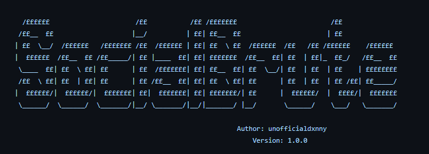

<h1 align="center">SocialBrute</h1>
<p align="center">This is a bruteforce attacker made in Python. Any misuse is beyond my responsibility this is for educational purposes only</p>

<p align="center">
  
</p>

## Requirements
----

- Python 3.9+
- getpass
- date 
- colorama
- sys
- time
- keyboard
- pyautogui 
- os
- requests 
- webbrowser
- time
- string
- random

---- 

## Usage
----

```
git clone https://github.com/unofficialdxnny/socialbrute

```

``` 
cd socialbrute

```

```
pip install requirements.txt

```

```
python main.py

```


### NOTE: Removed the final code snippet to prevent `SKIDS` from abusing the tool


## Code Explanation


